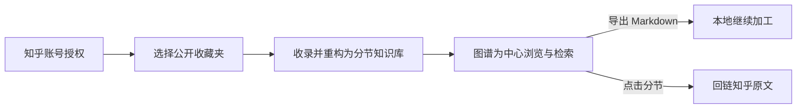

# Zhilore · 知脉

> **把知乎收藏，连成一张能用的知识网络**
>
> 让收藏过的内容，从「存下来了」变成「用得上」。

**在线体验 → [https://47.96.253.135/](https://47.96.253.135/)**

Python 3.13 · FastAPI · SQLite · 零构建原生前端 · Docker 单容器部署

---

## 在线体验

用你自己的知乎账号授权即可进入，全程不需要在本项目输入密码。

| 入口 | 地址 | 能做什么 |
| --- | --- | --- |
| 账号与收藏 | [https://47.96.253.135/](https://47.96.253.135/) | 知乎账号授权、浏览公开收藏夹、收录最近一页摘要 |
| 个人知识库 | [https://47.96.253.135/workspace/](https://47.96.253.135/workspace/) | 关系图谱、全文搜索、分节阅读与跨文章关联 |

未登录访问工作区会先跳到登录页，授权完成后自动回到原目标页面。

演示环境说明：

- 内容按你自己的知乎账号隔离，不同用户之间互相看不到。
- 私密收藏夹**不在开放范围**，既不读取也不显示名称。
- 演示为单实例部署，每个账号最多保存 2,000 条摘要。

---

## 它解决什么问题

知乎用户每天收藏大量回答与文章，但**收藏是终点，不是起点**。

点一次收藏的成本极低，而「一年后再打开、再找到、再用上」的成本极高——收藏夹由此变成信息黑洞：按时间倒序堆叠，没有索引、没有结构、没有关联。

主流 AI 工具解决的是「我不想读」，做法是给长文配一段摘要。但摘要之后信息依然是扁平的：不可定位、不可组合、不可跨文章关联，用户读到了结论，却丢掉了论证链路。

而知乎的内容形态恰恰**最不该被摘要**：以长文为主，有清晰的标题层级、成熟的标签体系、大量「同一问题下的多角度回答」——这是知识管理最理想的原生素材。

所以知脉不做 AI 摘要，做**知识重构**。

---

## 四条设计原则

### 分节优先于摘要

一篇讲 RAG 落地的长文，拆成「切分策略 / 检索 / 重排 / 常见坑」四个分节后，每个分节都能独立成立、被单独引用、与另一篇文章的同主题分节并列阅读。摘要做不到这一点——它把可拆解的结构压成了一个不可拆解的点。

### 图谱驱动，而不是列表加搜索框

默认进入全幅关系图谱，四类节点全部可单击打开：

| 节点 | 打开后看到 |
| --- | --- |
| 文章 | MOC 总览：摘要、来源、分节阅读线、关联文章 |
| 分节 | 正文，带上一节 / 返回总览 / 下一节与跨文章关联 |
| 概念 | 该标签在全部文章中的出现位置与共现标签 |
| 标签 | 按文章分组的关联分节列表 |

阅读面板以分栏形式覆盖在图谱上，关闭即回到完整图谱——浏览时不会丢失全局视角。列表、全文搜索、`#标签` 精确查询、节点拖拽整理、地址深链接与键盘导航一并保留。

### 溯源保留，不做搬运

每个分节都带原文链接、作者、所属收藏夹；图片本地化但保留归属；概念页标明每个分节来自哪篇文章、哪个收藏夹。用户带走的是自己的知识结构，回看时会回到知乎。

### 证据与派生分离

原始抓取归档在证据层（`.raw/sources`），而派生产物（分节 / MOC / 概念页 / 图谱）全部可以随时重建，并以内容哈希校验完整性。这让「让 AI 处理我的内容」这件事变得安全：结果不满意可以推倒重来，原始证据永远在。

---

## 使用流程



1. **授权**——由本人在知乎侧完成登录与授权确认，后端识别出稳定用户 ID，建立仅属于该用户的会话。
2. **选择收藏夹**——列出当前用户公开范围的收藏夹，并如实标注上限与未提供分页的事实。
3. **收录与重构**——抓取 → 分节重构 → 生成标签网络与图谱；已处理且未变化的内容自动跳过。
4. **浏览**——图谱、搜索、分节阅读；可导出 Markdown 到本地继续加工。

更完整的产品思路见 [产品说明计划书](产品说明计划书.md)。

---

## 快速开始

### 本地运行

```bash
pip install -r 工具/requirements-oauth.txt
python 工具/OAuth验证服务.py
# 打开 http://127.0.0.1:8100
```

未配置凭据时服务照常启动，只是授权按钮保持禁用——不伪装成已绑定，也不提供模拟账号。

### Docker

```bash
cp .env.example .env        # 按模板填写，不需要的项保持注释状态
docker compose up -d --build
# 打开 http://127.0.0.1:8099
```

### 配置

跑通登录需要三项：

| 变量 | 用途 |
| --- | --- |
| `ZHIHU_OAUTH_APP_ID` / `ZHIHU_OAUTH_APP_KEY` | 知乎开放平台分配的应用凭证 |
| `ZHIHU_OAUTH_REDIRECT_URI` | 必须与登记值**完全一致**（协议、域名、路径、尾部斜杠），本项目路径固定为 `/auth/zhihu/callback` |
| `ZHIHU_ACCESS_SECRET` | 可选。只影响收藏夹读取，缺失时登录照常可用 |

> ⚠️ 本项目把「已设置但为空」判定为**非法配置**，且不会回落到默认值。不需要的变量请保持注释状态，不要留成 `KEY=` 这样的空行。

完整变量说明见 [.env.example](.env.example)，接入细节见 [OAuth 接入与验收](OAuth接入与验收.md)。

---

## 技术架构

| 层 | 实现 |
| --- | --- |
| 后端 | Python 3.13 · FastAPI · uvicorn · httpx |
| 存储 | SQLite，按知乎稳定用户 ID 隔离的摘要快照；**不存 Token** |
| 前端 | 零构建的原生 JavaScript；图谱为手写 Canvas 渲染，不依赖图表库 |
| 部署 | 单容器 Docker（`python:3.13-slim`），数据卷挂载 `./数据`，`workers=1` |

```text
工具/
├── OAuth验证服务.py      对外主入口（8100）
├── 应用.py              容器内入口（8099，监听 0.0.0.0）
├── zhihu_oauth/         OAuth 协议、公开收藏读取、按用户隔离的工作区
├── 抓取.py              收藏抓取（官方 CLI / 网页兼容模式）
├── 知识重构.py          分节重构（模型可用时调用，否则确定性规则降级）
├── 处理.py              标签、双链、MOC 与图谱生成
└── tests/               Python 与 Node 两套回归
网页/
├── graph.js             图谱与阅读工作区
├── oauth/               账号页、工作区、登录页适配层
└── lib/                 本地化的 KaTeX / highlight.js 等前端依赖
部署/
└── 服务器部署.sh         容器化部署脚本
```

### 安全设计

- 凭据只进环境变量；源码、日志、报告、镜像中不留任何密钥。
- Token 仅存在于服务端内存，退出 / 过期 / 重启即失效，不落库。
- 所有读写按服务端识别出的稳定用户 ID 限定，**不接受浏览器指定他人 ID**。
- 授权回调严格校验一次性 `state`；鉴权失败绝不回落到开发者账号。
- 笔记与图片接口限制在知识库目录内，目录穿越与越界链接不作为可读内容暴露。
- 空库或文件缺失时返回结构完整的空索引，不泄露内部路径。

---

## 数据边界

以下都是**平台开放范围下的设计约束**，不是未完成的缺陷：

- 只读取官方允许的**公开收藏夹**；私密收藏夹不读取、不显示名称。
- 收藏夹列表最多 50 个，列表接口未提供分页，不保证列出全部。
- 内容每页 20 条，手动按 NextOffset 加载；只保存最近成功读取的一页，不批量遍历账号。
- 收录的是标题、摘要、来源及必要元数据，**不是全文**。
- 图谱中的连接表示摘要所属收藏夹，**不是语义推断出的关系**。
- 同一账号重复授权仍可看到已保存的摘要；退出登录不会删除已收录内容。
- 当前为单实例、单进程演示，不支持多 worker 或无状态多副本部署。

---

## 测试

```bash
# Python：服务、OAuth、用户隔离、流水线
python -m unittest discover -s 工具/tests -p "test_*.py"

# Node：图谱交互与前端竞态
node --test 工具/tests/*.cjs
```

覆盖授权全链路（一次性 state 绑定、登录回跳、取消 / 过期 / 403、外站拦截）、用户数据隔离、图谱节点交互、搜索竞态、路径安全等场景，两套合计 600 余项。

---

## 内容归属

- 所有内容版权归原作者与知乎所有，本项目只做**个人学习归档与重新组织**。
- 任何分节、概念页均保留原文链接与作者，阅读时回链知乎站内。
- 请勿使用本项目二次公开他人内容。

---

## 关于

知脉（Zhilore）是 **知乎黑客松 2026 · 校园新锐季** 的参赛作品，以「收藏之后」这一环为切入点，探索长文内容形态下的知识管理方式。

仓库为作品公开展示用途，暂未附开源许可证，如需引用请先联系作者。
