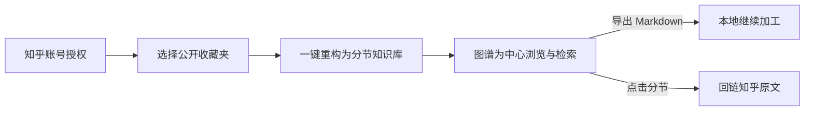
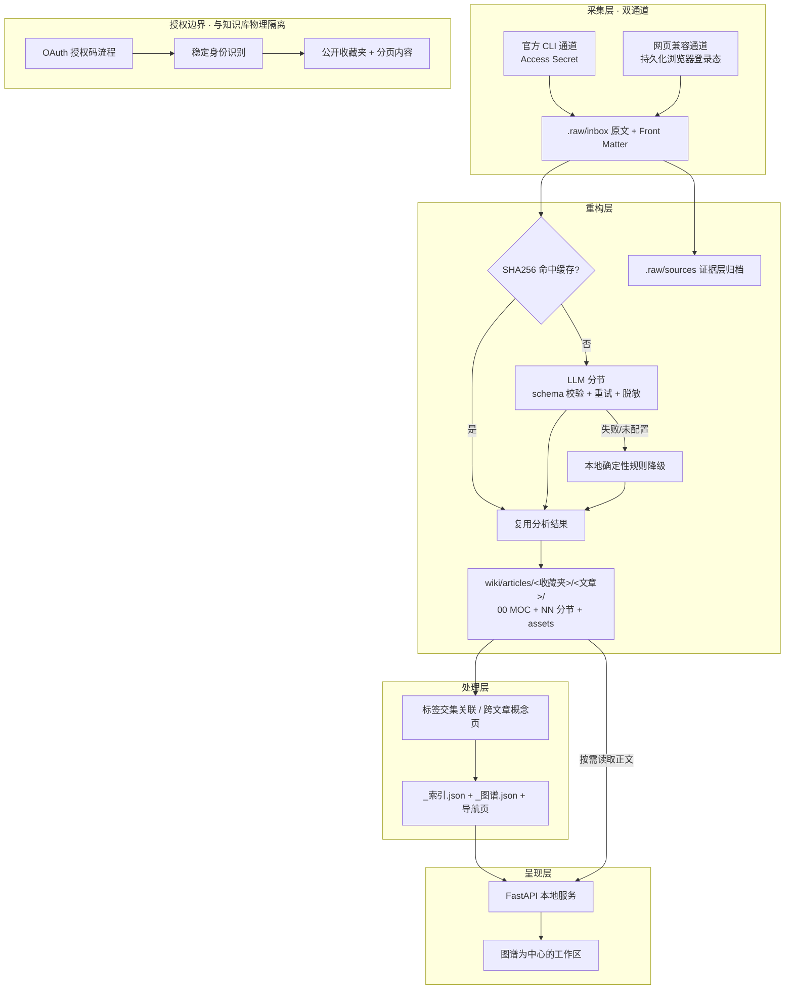

# 知脉 · 产品说明计划书

> 把知乎收藏，连成一张能用的知识网络
>
> 参赛活动：知乎黑客松 2026 · 校园新锐季（`zhihu_hackathon_2026_p2`）
> 文档版本：v1.0 ｜ 2026-09-13
> 说明：「知脉」为工作名，可替换；文中「已实现 / 待验证」均按真实状态标注。

---

## 摘要

知乎用户每天收藏大量回答与文章，但**收藏是终点，不是起点**。一次点击的成本极低，而"一年后再打开、再找到、再用上"的成本极高，收藏夹由此变成信息黑洞。

知脉不做"AI 总结全文"，而是做**知识重构**：把一篇长文拆成若干可独立阅读、可互相引用的分节，再用标签、双链与跨文章概念页把它们连成网络，并导出为可长期持有的本地 Markdown 资产。所有产物保留原文链接与作者，阅读时回链知乎站内。

一句话：**让收藏过的内容，从"存下来了"变成"用得上"。**

---

## 一、创作思路

### 1.1 我们看到的真实问题

知乎的核心资产是内容，而用户与内容之间最脆弱的一环是**收藏之后**。

- **收藏是最高频的"沉淀"动作，也是最大的断点。** 用户点收藏时的心智是"这个以后有用"，但收藏夹没有提供"以后"的入口：它是按时间倒序堆叠的列表，没有索引、没有结构、没有关联。
- **现有 AI 工具解决的是"我不想读"，不是"我想用"。** 主流做法是给长文生成一段摘要。摘要之后信息依然是扁平的：不可定位、不可组合、不可跨文章关联。用户读到了结论，却失去了论证链路。
- **知乎的内容形态，恰恰最不该被摘要。** 知乎以长文为主，有清晰的标题层级、有成熟的标签体系、有大量"同一问题下的多角度回答"。这是知识管理最理想的原生素材，被压成一段摘要反而浪费。

### 1.2 三个设计原则

**原则一：分节优先于摘要。**
知识单元的价值不在"更短"，而在"可以被重新组合"。一篇讲 RAG 落地的长文，拆成"切分策略 / 检索 / 重排 / 常见坑"四个分节后，每个分节都能独立成立、能被单独引用、能与另一篇文章的同主题分节并列阅读。摘要做不到这一点——它把一个可拆解的结构压成了一个不可拆解的点。

**原则二：溯源保留，不做搬运。**
每个分节都带原文链接、作者、所属收藏夹；图片本地化但保留归属；概念页也标明每个分节来自哪篇文章、哪个收藏夹。这不是"二次创作"，是"重新组织"——用户带走的是自己的知识结构，回看时会回到知乎。

**原则三：证据与派生分离，AI 结果可重建。**
原始抓取内容归档在证据层（`.raw/sources`），派生产物（分节、MOC、概念页、图谱）全部可以随时重建。这让"让 AI 处理我的内容"这件事变得安全：处理结果不满意可以推倒重来，原始证据永远在，且以内容哈希校验完整性。

### 1.3 目标用户

- **核心用户：在知乎上做系统性学习的人。**
  学生、研究者、技术从业者、行业观察者。他们的特征不是"刷知乎"，而是"用知乎"——为解决一个具体问题去读一批长文，读完需要留下来、用起来。
- **典型收藏夹形态：** AI/大模型技术笔记、考研专业课资料、行业研究报告、创业案例库、城市旅行攻略。
- **他们现在的困境：** 收藏了 200 篇，一年后能想起来的不到 5 篇；想引用某个观点，只能靠模糊记忆重新搜索。

**不是我们的用户：** 只想快速看热点、不需要沉淀的人。知脉不追求覆盖全部知乎用户，只服务"有沉淀需求"的那一部分——而这部分人恰好是知乎知识氛围最核心的贡献者与消费者。

### 1.4 产品形态

知脉是一个**本地优先的知识工作台**：一条命令抓取自己的收藏，一条命令重构成知识库，一个网页完成浏览。

- 数据是你的：Markdown + 本地图片，可直接放进 Obsidian 或任意编辑器。
- AI 是可替换的：模型可用时做高质量分节，模型不可用时用确定性规则降级，流水线不中断。
- 浏览是图谱驱动的：不是"文档列表 + 搜索框"，而是一张「文章—分节—标签—概念」的关系网络，同时保留完整的列表与搜索入口。

---

## 二、用户如何完成核心体验

从"授权"到"看到自己的知识网络"，主流程四步，总耗时以分钟计。



**第 1 步 · 授权。** 用户在网页点击「使用知乎账号授权」，由本人完成知乎侧的登录与授权确认（不向任何第三方提供密码）。后端拿到用户 Token 后识别出**稳定用户 ID**，建立仅属于该用户的会话。

**第 2 步 · 选择收藏夹。** 页面列出当前用户**公开范围**的收藏夹（私密收藏夹不出现在开放范围，且明确告知上限与未提供分页的事实）。用户勾选要处理的目标。

**第 3 步 · 一键重构。** 抓取 → 分节重构 → 生成标签网络与图谱。用户可以全程看到进度；已处理且未变化的内容自动跳过，不重复消耗模型调用。

**第 4 步 · 浏览。** 默认进入全幅**关系图谱**。每个节点都能单击打开：

| 节点类型 | 打开后看到 |
| --- | --- |
| 文章 | MOC 总览：摘要、来源、分节阅读线、关联文章 |
| 分节 | 正文，带上一节 / 返回总览 / 下一节与跨文章关联 |
| 概念 | 该标签在全部文章中的出现位置与共现标签 |
| 标签 | 按文章分组的关联分节列表 |

阅读面板以分栏形式覆盖在图谱上，关闭即回到完整图谱——浏览时不会丢失全局视角。支持全文搜索、`#标签` 精确查询、节点拖拽整理、地址深链接与键盘导航。

**关键体验细节：** 首屏只加载索引与图谱，不预读正文；正文按需拉取并缓存；连续搜索与切换笔记不会被过期响应覆盖。这让"200 篇文章的知识库"在打开时依然是秒级响应。

---

## 三、技术方案

### 3.1 总体架构

五层结构，前四层是知识生产流水线，第五层是独立的授权边界。



### 3.2 采集层：双通道，各有明确边界

项目不假设"一套接口能解决所有事"，而是把两条通道的分工写清楚：

- **官方通道**：调用知乎官方 CLI 读取本人收藏夹与收藏夹条目，使用开放平台 Access Secret。适配了条目规范化、Offset 分页、`NextOffset` 合法性校验，并对"返回重复 Offset"直接中止以避免死循环。
- **网页兼容通道**：复用持久化浏览器登录态，用于获取官方接口当前未提供的**正文与图片**。

两条通道输出统一格式（带 Front Matter 的 Markdown + 本地图片）汇入收件箱，下游重构层不关心数据来自哪条通道。这个设计承认了平台的现实约束：**开放平台给什么就用什么，不给的部分用兼容通道补齐，但不把兼容通道的假设混进开放平台链路。**

### 3.3 重构层：把长文拆成可组合的知识单元

这是产品差异化最核心的一层，也是工程上最需要"设防"的一层——因为 LLM 输出天然不稳定。

**分节生成。** 以「知乎文章知识架构师」角色约束模型：只输出 JSON，schema 固定为 `{summary, article_tags, sections:[{title, markdown, tags, key_points}]}`，要求 3–8 个分节、每节 2–5 个具体标签、保留原文事实与数据不得虚构、`markdown` 不重复一级标题、中文输出。

**四道防线（不让不稳定的模型输出污染知识库）：**

1. **schema 校验**：输出必须是 JSON 对象且含非空 `sections`；分节数必须在 2–12 之间，否则整体判失败。
2. **标签清理**：剥离 `#`、空白转连字符、过滤文件系统非法字符、单标签长度上限 24、按小写去重、每节上限 5 个。
3. **长度与内容约束**：摘要上限 1200 字、分节正文上限 16000 字、要点上限 5 条。
4. **敏感信息脱敏**：送模型前对邮箱与手机号做替换，避免把用户隐私送进第三方模型。

**降级路径。** 模型未配置、调用超时、返回非法 JSON——任一情况发生，自动落到确定性本地规则：优先按 `#` 标题层级切块（自动识别代码围栏，不把代码块里的 `#` 当标题），标题不足 2 个则按段落均分，再退化为前后半。**流水线永不因模型不可用而中断**，代价是分节质量下降——这个权衡被明确地记录在每篇文章的 `processing` 字段里（`llm` / `local-fallback` / `codex-offline`），用户始终知道自己的内容是哪种方式生成的。

**增量与缓存。** 每篇原文正文计算 SHA256。缓存有效且 MOC 存在 → 直接跳过；缓存有效但需重建 → 复用分析结果，不重复调用模型；显式 `--重新分析` 才忽略缓存。这既控制了模型成本，也让反复运行成为安全操作。

**产物结构：**

```text
wiki/articles/<收藏夹>/<文章标题>/
├── 00 MOC.md        摘要 + 分节阅读线 + 标签网络 + 来源 + 跨文章关联
├── 01 <分节标题>.md  独立标签、正文、本文脉络、跨文章关联
├── 02 <分节标题>.md
├── _analysis.json   按原文 SHA256 校验的分析缓存
└── assets/          本文图片（本地化，保留归属）
```

### 3.4 处理层：让标签产生网络效应

关联不是简单的"标签相同就推荐"，否则会产生大量噪音连接。三条规则：

- **标签交集算相关**，且**同一篇文章最多占两个推荐位**——避免一个人气作者的文章占满整个关联区。
- **只有至少两篇不同文章的分节共享某标签，才生成概念页。** 同一文章内部的多个分节共享标签不触发概念页，这直接过滤掉了"文章自己跟自己做概念"的伪概念。
- **没有概念页的标签用 `#标签` 关联分节链接**，而不是生成指向不存在页面的双链——保证全库双链零死链（当前 159 处双链，0 缺失目标）。

处理层同时维护全库入口 `index.md`、收藏夹导航 MOC、紧凑索引 `_索引.json` 与独立图谱 `_图谱.json`。**内容不变则不重写文件、保留修改时间**，这让"重新处理"成为可随时执行的幂等操作。

### 3.5 呈现层：图谱是主工作区，不是装饰

前端不是"文档列表 + 搜索框"的传统形态，而是把关系网络作为第一视角。

**加载策略（决定性能上限）：**
- `/api/索引` 只返回紧凑文章/分节元数据，**不内嵌正文与图谱**；`/api/图谱` 独立加载。
- 正文通过 `/api/笔记` 按需读取，前端缓存，用请求序号避免旧响应覆盖新请求。
- 全文搜索在**服务端启动或重扫成功后**建立内存搜索文档缓存，不随每次搜索重读全部 Markdown；`#RAG` 走精确标签查询，与全文关键词 `RAG` 语义区分。
- 重扫接口有服务端互斥锁，重复请求返回 409；重扫后保留图谱节点坐标与手动视点。

**交互能力：** 全幅图谱常驻；节点单击打开、可拖拽整理、空白平移、滚轮/± 缩放、Home 适应全部；右上角节点搜索，图谱聚焦后支持方向键 + Enter；标签与笔记支持地址 hash 深链接及浏览器前进/后退；阅读面板展开时暂停主图绘制；窄屏改为图谱在上、阅读在下。

### 3.6 授权边界：独立应用，物理隔离

OAuth 部分刻意做成**与知识库完全分离的独立应用**，原因是共享文件知识库天然不适合多用户——给共享目录加一个登录按钮，等于给所有人开放同一份数据。因此：

- 独立服务（`工具/OAuth验证服务.py` + `工具/zhihu_oauth/`）**不挂载共享笔记库**，只是独立的授权验证入口。
- **安全边界：** 随机 `state` 单次消费 + 绑定浏览器 Cookie，缺失直接拒绝（**不为了效果好看而删掉这项校验**）；POST 同时校验 `Origin` 与 `Content-Type`；`__Host-` Secure / HttpOnly / SameSite=Lax Cookie；完整 CSP、`no-store`、HSTS、不开放 CORS；上线链路不跟随重定向（避免把 Token 转发到重定向目标）、响应体上限 2MB、鉴权失败**绝不回落到开发者账号**。
- **数据最小化：** 非公开收藏夹的记录**连标题和描述都不复制**；收藏夹内容每次翻页都重新核验该收藏夹仍在当前用户的公开列表中；登录、切号、会话过期期间到达的晚到响应一律抑制，不显示上一个账号的数据。
- **错误诚实：** 限流/配额、权限不足、Token 过期、接口失败都有各自的真实提示与 `Retry-After`，不伪装成"空成功"。
- **会话是临时的：** 授权流程 10 分钟有效期、会话最长 8 小时且不超过 Token 到期时间，重启即失效。这是刻意的：验证阶段不做持久 Token 存储。

### 3.7 安全与合规工程

- **路径越界防护**：笔记与图片接口限定在 `wiki` 目录内；原文、分析缓存、目录穿越与越界链接不作为可读笔记暴露；图片响应带类型保护与隔离头。
- **凭据治理**：App Key / Access Secret / API Key 只从环境变量或项目外配置读取，不写入源码、报告或日志。Windows 启动器使用隐藏输入，新值只进入当前进程与子进程环境，退出或异常后移除并恢复运行前的原值；`-CheckOnly` 可在不访问知乎的前提下校验配置格式。
- **内容治理边界**：所有产物保留作者与原文链接，不把原文改写为"由本应用创作"；控制单次读取与输出长度；内容仅供个人学习归档，不二次公开他人内容；不批量、不高频、不做无意义请求，调用侧有缓存与请求去重。

---

## 四、使用的知乎开放能力

| 知乎能力 | 在知脉中的用途 | 状态 |
| --- | --- | --- |
| OAuth 授权（`app_id` / `app_key`） | 用户本人登录、回调、服务端换取 Token | 已实现；真实双账号授权待平台联调 |
| 稳定身份识别 | 以平台确认的稳定用户 ID 建立会话与数据归属，**不使用昵称或 Token 字符串当 ID** | 已实现适配器；接口契约待平台确认 |
| 用户收藏夹 `/api/v1/user/favlists` | 列出当前授权用户的公开收藏夹 | 已适配公开范围 |
| 收藏夹内容 `/api/v1/user/favlist_contents` | 20 条/页、游标翻页、去重，展示标题与摘要 | 已适配 |
| 官方 CLI（Access Secret） | `me favorites lists` 与收藏夹条目，作为采集层官方通道 | 已适配 |
| 知乎搜索 | **路线图**：以用户已有收藏为种子，发现同主题的更多站内内容，补全知识库 | 规划中 |
| 知乎直答 | **路线图**：基于用户自己的知识库 + 知乎内容做追问式问答，答案回链来源 | 规划中 |
| 知乎热榜 | **路线图**：作为"我关注的领域今天有什么新内容"的发现入口 | 规划中 |

**能力选择的原则：** 本次主链路只使用**用户数据类**能力（OAuth + 收藏夹），因为产品的第一个问题必须是"帮用户管理自己的东西"，这不需要任何开放内容接口就能成立、也最符合用户预期。搜索/直答/热榜作为**增量发现层**，在知识库成型后才真正产生价值——它们是让用户"持续回来"的部分，而不是冷启动的部分。

---

## 五、与知乎社区生态的契合点

### 5.1 内容形态契合：知乎内容天然适合被结构化

知脉的核心操作是"按语义边界切分长文"。而知乎的主流内容形态恰好提供了三个现成条件：

- **清晰的标题层级**：知乎长回答与专栏文章普遍使用多级标题，这为分节提供了天然的语义边界——我们不需要猜测在哪里切。
- **成熟的标签体系**：用户与平台已形成标签习惯，标签网络有真实的语义基础，不是凭空造出来的分类。
- **同一问题的多角度回答**：知乎的核心形态决定了"同一个概念会散落在几十篇不同立场、不同深度的文章里"。这正是跨文章概念页价值最大的场景——只有知乎这样内容密度的社区，概念页才真正"汇得起来"。

换一个内容平台，这套方案的效果会明显下降。**这是知乎内容特性与知识管理方法的一次匹配，不是通用工具套壳。**

### 5.2 用户行为契合：接在"收藏"这个断点上

收藏是知乎最高频的沉淀动作，而它之后几乎没有产品承接。知脉不做新的行为习惯，而是**强化一个已有习惯**：用户不需要学习"要先建笔记、要先分类"，只需要做他本来就在做的事——收藏。剩下的由流水线完成。

这带来一个重要的产品优势：**冷启动成本几乎为零。** 用户打开知脉时，知识库的"原材料"已经在他自己的知乎收藏夹里了。

### 5.3 价值观契合：回链站内，而不是把内容搬走

知乎对内容的立场是清晰的——内容归属于创作者与平台。知脉在这一点上做了刻意的设计：

- 每个分节保留**原文链接与作者**，阅读行为最终引导回知乎站内；
- 概念页标明每个分节来自哪篇文章、哪个收藏夹，不制造"无源内容"；
- 导出的是**结构与索引**，不是可再分发的转载品；
- 私密收藏夹不在读取范围，内容使用边界写进产品与文档。

因此知脉不是"把知乎内容搬去别的地方"，而是**为知乎内容做一层长期可用的索引层**——它增加站内阅读的入口，而不是减少。

### 5.4 平台能力契合：把"用户数据"用在对用户最有利的地方

知乎开放平台提供的用户数据能力（授权、创作、关注、收藏），最自然的用途就是"帮用户管理自己的内容"。知脉选择了收藏夹这个入口，理由是：

- **数据边界清晰**：只读公开范围，不触碰他人私密数据；
- **用户收益直接**：管理自己的收藏，用户第一眼就能感知价值；
- **与创作者无冲突**：不抓取、不转载他人创作，只在用户自己的收藏范围内工作，并保留全部归属信息。

---

## 六、对社区用户的实际价值

### 6.1 对普通用户：把"收藏即遗忘"变成"收藏即资产"

| 收藏之前 | 使用知脉之后 |
| --- | --- |
| 收藏夹是按时间倒序的列表，找不到东西 | 带索引、可全文搜索、可标签过滤的知识库 |
| 想引用某个观点只能凭记忆重新搜索 | 分节粒度检索，直接定位到具体论点 |
| 一篇长文读完，记得结论忘了论证 | 阅读线保留原有结构，可逐节回看 |
| 收藏积累到几百条后彻底放弃整理 | 增量重构，新收藏自动汇入，不需要重新整理 |
| 内容锁在平台里，无法迁出 | 导出标准 Markdown + 图片，进入自己的知识工作流 |

最深的一层价值是：**用户第一次能看到"我收藏的东西之间有什么关系"。** 收藏 200 篇 AI 文章的人，往往从未意识到自己已经积累了关于 RAG 的六段论述、关于向量数据库的三组对比。图谱与概念页把这个隐藏的结构显式化了。

### 6.2 对创作者：延长内容的生命周期

- **长尾曝光**：优质内容不再只是一次性获得赞同与收藏，而是进入他人的知识网络，被反复打开和引用——每一次打开都回链原文。
- **分节级的可发现性**：一篇长文中某个具体的、有价值的观点，可以独立被检索到。这意味着"文章里的某一段"也能持续带来流量。
- **不损失归属**：作者名与原文链接始终跟随内容出现，不存在"被二创后失去署名"的问题。

### 6.3 对社区生态：把沉淀重新变成流通

知乎的长期挑战之一，是优质内容在时间轴上被新内容不断淹没。知脉提供了一个不依赖算法推荐、由用户自己驱动的**内容复活机制**：

- 老内容因为进入知识网络而重新被阅读，而不是永久沉底；
- 用户的收藏行为获得正反馈（收藏真的变成资产），会鼓励更认真的收藏与阅读；
- 沉淀下来的结构化知识，让"在知乎做系统性学习"这件事真正可行——这直接服务于知乎知识社区的定位。

**一句话概括社区价值：知乎最好的内容，值得一个比"收藏夹"更好的归宿。**

---

## 七、当前完成度与验证

我们严格区分"代码已完成"与"线上已可用"。

### 7.1 已实现并经过本地验证

| 模块 | 状态 |
| --- | --- |
| 采集层（官方 CLI 通道 + 网页兼容通道） | 可运行；凭证经官方 CLI 验证有效 |
| 重构层（LLM 分节 + schema 校验 + 本地降级 + SHA256 增量） | 可运行；4 道防线与降级路径均有测试覆盖 |
| 处理层（标签网络、跨文章概念页、导航、索引、图谱） | 可运行；内容不变不重写已验证 |
| 呈现层（图谱工作区、搜索、深链接、窄屏、主题） | 可运行；首屏仅加载索引与图谱 |
| 授权边界（独立 OAuth 应用与安全策略） | 已实现；隔离客户端与模拟平台响应通过 |

**当前知识库基线（真实数据）：** 6 篇文章 → 27 个分节 → 36 个分节标签 → 2 个收藏夹；1 个跨文章概念页（RAG）；37 份 Markdown；159 处双链、0 缺失目标；图谱 70 个节点、90 条边。

**测试基线：** 133 个 Python 测试 + 95 个 Node 测试全部通过；13/13 组模拟浏览器检查通过；此前图谱改版中 70/70 个节点已在真实浏览器逐一点击验收。

### 7.2 仍需完成（提交前）

| 待办 | 说明 |
| --- | --- |
| 公网 HTTPS Demo 部署 | 需单实例、单 worker 容器 + 反向代理，回调地址与登记值完全一致 |
| 真实双账号 OAuth 联调 | **真实账号授权当前为 0 / 2**；需要平台确认 `state` 回传规则与完整身份接口契约 |
| 端到端主流程贯通 | 把"授权 → 公开收藏夹 → 一键导入 → 图谱浏览"连成一条可演示的线上路径 |

我们把最后一项列为**最高优先级**，因为它决定了作品能否通过"可从公网正常打开并完成核心流程"这一硬性检查。已实现的部分与待验证的部分在文档、接口响应与页面上都明确区分，不做"看起来能跑"的表述。

---

## 八、路线图

**近期（提交前）**
完成公网 HTTPS 部署与真实双账号授权联调，打通端到端主流程，使线上 Demo 可完整演示"授权 → 导入 → 图谱浏览"。

**中期（1–3 个月）**
- 通过知乎搜索为用户补全同主题站内内容，把"我的收藏"扩展为"我的领域"；
- 接入知乎直答，基于用户自己的知识库做追问问答，答案标注来源分节并回链原文；
- 按稳定用户 ID 做真正的多用户数据隔离（独立笔记库、独立索引与搜索）；
- 用 SQLite FTS5 或倒排索引替换内存全文搜索，支撑数千篇规模。

**长期（3 个月以上）**
- 沉淀领域公共概念页，让"知乎上关于某个概念的集体论述"成为可浏览的社区资产；
- 支持把知识库里的一条脉络导出为可分享的知识卡片，卡片回链原回答；
- 内容变更检测与自动更新（保存 `updated_time` 与内容哈希，原文被编辑时自动重建）。

---

## 九、边界与合规声明

1. **数据范围**：只读取当前授权用户的**公开**收藏夹；私密收藏夹不在开放范围。列表接口未提供分页，我们明确告知上限与"不保证已列出全部"，不宣称列全了。
2. **凭证安全**：App Key、Access Secret、OAuth Token 与模型 API Key 只存在于后端环境变量或项目外配置，不进入前端、URL、日志、截图或代码仓库。
3. **内容归属**：所有产物保留作者、原文链接与来源归属；不将他人原文改写为"由本应用创作"；内容仅供个人学习归档，不二次公开他人内容。
4. **调用克制**：不批量、不高频、不做无意义请求；调用侧有缓存与请求去重；接口失败、额度耗尽、空数据都呈现真实状态，不循环重试，不伪装成功。
5. **能力边界**：黑客松配套的故事与知识内容接口仅面向本次比赛，其路径与可用状态在活动结束后可能调整；本项目不假设其为长期稳定的通用内容接口。
6. **成熟度声明**：当前实现为验证阶段，非生产就绪。会话存于内存、单实例运行、无 Token 刷新与撤销契约；持久登录、多实例与公开长期运营需另行实现受控 Token 存储、数据隔离、密钥轮换与运维隐私策略。

---

## 附：技术栈

| 层 | 技术 |
| --- | --- |
| 采集 | Python、官方 zhihu-cli、Patchright / Chromium 持久化上下文 |
| 转换 | 定制 HTML → Markdown（公式、懒加载图片、代码围栏、表格、引用） |
| 重构 | OpenAI-compatible Chat Completions（JSON schema 约束）、确定性本地降级规则 |
| 处理 | Python、标签交集算法、内容哈希增量 |
| 服务 | FastAPI + Uvicorn |
| 前端 | 原生 JavaScript、Marked + DOMPurify、Canvas/SVG 图谱 |
| 授权 | OAuth 2.0 授权码流程、httpx、内存会话存储 |
| 测试 | Python `unittest`（133）+ Node `node:test`（95）+ 浏览器交互验收 |
