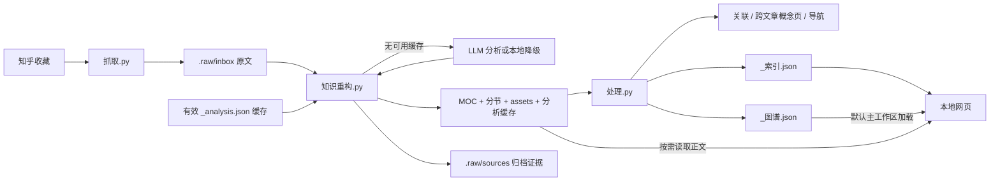

# 知识库工作流

把收藏文章变成可检索、可跳转的分节知识单元，同时将原始证据与派生结果分离。以下以 `D:\项目ai\知乎` 为项目根目录。



## 一、证据与文章

新抓取原文进入 `笔记库/.raw/inbox/<收藏夹>/`，成功重构后归档到 `.raw/sources/<收藏夹>/`。证据层不进入网页搜索，也不作为人工编辑区。

派生文章落在 `wiki/articles/<收藏夹>/<文章标题>/`：

- `00 MOC.md`：摘要、原文来源、分节阅读线、文章标签、关联 MOC。
- `01 <分节标题>.md` 等：独立标签、正文、上一节 / 返回总览 / 下一节与跨文章关联。
- `_analysis.json`：包含原文正文哈希及分析结果的缓存；不经笔记 API 暴露。
- `assets/`：本文可显示的本地图片。

分节 Front Matter 保留 `schema`、`type: section`、`title`、`article`、`collection`、`order`、`tags`、`processing`、`related` 等字段。现有离线结果标记为 `codex-offline`；无模型配置的新分析通常为 `local-fallback`。

## 二、增量与缓存

1. 默认发现旧式收藏夹目录和 `.raw/inbox`，不重新遍历 `.raw/sources`。
2. 校验原文正文 SHA256、缓存结构和分节内容。缓存有效且 MOC 存在时跳过，不重复分析。
3. 需要生成时优先复用有效缓存；否则调用配置好的 OpenAI-compatible 模型，无配置或失败则本地降级。
4. 生成文章并归档原文。
5. `处理.py` 维护关联、导航、索引和图谱；内容相同不重写，保留修改时间。

| 需求 | 命令（在项目根目录） | 注意 |
| --- | --- | --- |
| 增量处理新原文 | `D:\python\python.exe -X utf8 工具\知识重构.py` | 有新原文和模型配置时可能调用远端。 |
| 只检查现有知识库 | `D:\python\python.exe -X utf8 工具\处理.py --不写回` | 不写笔记、索引或图谱，也不抓取 / 分析。 |
| 更新关联和索引 | `D:\python\python.exe -X utf8 工具\处理.py` | 不调用模型，不抓取。 |
| 从归档重建派生文章 | `D:\python\python.exe -X utf8 工具\知识重构.py --包含归档 --强制` | 先备份；重写生成目录，仍复用有效缓存。 |
| 忽略缓存重新分析归档 | `D:\python\python.exe -X utf8 工具\知识重构.py --包含归档 --重新分析` | 先备份；配置模型时可能产生调用费用。 |

`--包含归档` 只扩展候选范围；`--强制` 不等于重新调用模型；`--重新分析` 才忽略缓存。`--本地` 保证不调用远端，但有效缓存仍优先复用；与 `--重新分析` 组合时会用本地规则重新拆分，可能改变现有结构。不应把这些重建选项用于普通刷新验收。

模型配置支持 `OPENAI_API_KEY`、`OPENAI_BASE_URL`、`OPENAI_MODEL`、`OPENAI_TIMEOUT_MS`、`OPENAI_MAX_ATTEMPTS`，可用 `--env-file` 从项目外文件加载；不要把凭据写入项目或日志。

## 三、关联、概念与导航

- 分节关联优先采用标签交集；同一篇文章最多占两个推荐位，避免单篇占满关联区。
- **至少两篇不同文章的分节共享标签，才生成概念页。** 同一文章的多个分节共享一个标签，不会单独触发概念页。
- `wiki/concepts/标签：RAG.md` 汇集该标签的分节及共现标签；没有概念页的共现标签用 `#标签` 关联分节链接，避免生成断双链。
- 所有分节标签仍进入标签统计与图谱，不因缺少概念页而消失。
- `wiki/index.md` 是全库入口，`wiki/collections/<收藏夹> MOC.md` 是收藏夹入口。
- 自动生成的关联区不参与语义摘要和字数统计，避免每次执行发生内容漂移；空库时清理旧的生成页、索引和图谱。

## 四、网页加载和刷新

- `/api/索引`：紧凑文章 / 分节元数据与入口，不内嵌全部正文或图谱。
- `/api/笔记`：按需读取 `wiki` 内 Markdown；前端缓存正文，切换笔记使用请求序号避免旧响应覆盖。
- `/api/搜索`：服务启动或重扫后建立正文搜索缓存；关键词搜索全文，`#标签` 精确匹配标签并包含分节。输入变化和关闭搜索会取消过期请求。
- `/api/图谱`：首屏加载独立图谱，默认全幅显示；正文仍按需读取，图谱不是弹窗。
- 节点入口：文章打开 MOC，分节和概念打开笔记；标签打开关联分节列表，存在概念笔记时再提供入口。
- 图谱常驻，阅读面板按需分栏；关闭阅读返回完整图谱。节点列表、方向键 / Enter、hash 深链接及浏览器前进 / 后退均可导航。
- 支持节点拖拽、空白平移、滚轮缩放与适应全部；点击与拖拽分开判定，窗口变化不随机重排，布局静止后停止动画。
- 文件树一次建立；展开 / 折叠只切换节点，搜索打开分节会展开对应祖先。
- 图片、公式和表格保留；图片接口检查 wiki 边界并设置保护响应头。

**左下角重新扫描不是抓取**：执行“默认增量重构 → 处理 → 重载索引 / 搜索缓存 / 图谱 → 重开当前笔记或标签”，使正文和图谱数据缓存失效；已有图谱节点坐标、选择和手动视点保留。执行期间禁用刷新按钮，后端也有互斥锁；重复请求返回 409，失败会释放锁。Windows 子进程显式使用 UTF-8，避免中文刷新日志乱码。

若新原文存在且配置模型，刷新可能触发远端分析；本次验收候选为 0，刷新不会调用模型。相比之下，`工具/一键更新.bat` 包含抓取，会访问知乎。

## 五、日常操作

```powershell
cd D:\项目ai\知乎
# 以下前三步是获取新内容的完整流程，不是只读验收
D:\python\python.exe -X utf8 工具\抓取.py
D:\python\python.exe -X utf8 工具\知识重构.py
D:\python\python.exe -X utf8 工具\处理.py
# 启动本地网页；同端口已有服务时无需再次启动
D:\python\python.exe -X utf8 工具\服务.py
```

只阅读已有库，直接访问 [本地网页](http://127.0.0.1:8099)；不需要抓取或重构。

## 六、2026-09-12 收尾与图谱改版基线

- 6 篇文章、27 个分节、36 个分节标签、2 个收藏夹；共 37 份 Markdown。
- 1 份跨文章概念页（RAG）；159 处双链，0 缺失目标、0 重复标题。
- 2 处完整本地图片引用都存在；硬件图浏览器实际尺寸 900×420。
- 图谱 70 个节点、90 条边，无缺失端点；70/70 个节点均通过真实浏览器逐一点击验收。
- `#RAG` 精确搜索 11 条结果，其中 6 条分节；概念页及共现标签均可跳转。
- 33 个 Python + 38 个 Node 测试全部通过，Python / JavaScript 语法检查通过；34/34 项浏览器交互验收通过（含窄屏、图片公式、搜索和重扫）。
- 默认首屏加载索引和图谱，不预读正文；70 个节点全部具有有效入口。点击节点后在阅读面板打开，保留主图。
- 标签单击统一走关联分节视图，不再触发全文搜索；重复渲染不会重复绑定事件。搜索竞态、图谱竞态、笔记切换到标签 / 图谱后的旧响应均有回归保护。
- `--不写回` 与再次正常处理均未改变库内文件内容或修改时间。对照收尾前备份，原始证据与 6 份分析缓存未改。本轮图谱改版与重扫验收后，63 个库内文件的内容与修改时间均和上一轮收尾快照一致。

详见 [图谱主界面验收](outputs/图谱主界面验收.md) 与原 [收尾验收报告](outputs/收尾验收报告.md)。旧离线摘要仍有重复来源信息或截断摘录，此次图谱界面改版不修改摘要；上一轮流水线收尾仅修复一处硬件 MOC 摘要中残留的图片语法。
